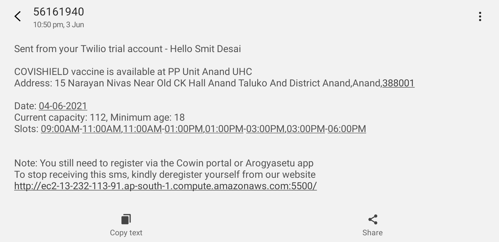

# GetYourVaccine

A web-application which notifies users via a SMS as a vaccine is available in 
their borough matching their demographic profile (age and vaccine preferences).

It was primarily build as India faced a vaccine shortage during it's intial vaccination drive
and the vaccine registration portal lacked a notifying feature. As a result of which, people had to
poll for vaccine every few hours. 

Note: Only works for Indian vaccination program. 

## Screenshots
<p align="center" width="100%">
  
  
</p>


## Working
* A user can register by creating a account 
* The server checks for vaccine every 3 hours
    * A list of all unique pincodes (borough indentifier) is queried from the databse
    * Vaccine information is fetched for every borough
    * Information of users living in a particular borough is queried from the database
    * Each user's vaccine preferences are matched with available vaccine data.
    * If there's a complete match, a SMS is sent to the user
* A user can deregister by entering his account credentials

## Optimizations

* Built mysql abstraction class with pool connections to avoid code repetition and database connection being re-established every time a request comes
<br/>

* Changed the mode of communication from emails to SMS.     
    * A majority of users checked emails twice-thrice a day. So by the time a user checks the email, the vaccine goes out of stock. Since SMS are checked instantly, it removed the communication latency
<br/>

* Prevented sending SMSs at night and reduced Twilio billing by 30%.     
    * SMSs send from 11pm-7am are reluctant as the user is sleeping (unless he/she/they is a programmer).

 
## Future planning

* Add unit tests.
* Check for mysql injections.
* Autenticate users by sending OTPs at registration.
* Allow users to select multiple boroughs.
* Make the UI more interactive.


## Run Locally

Note: The CoWin API will only accept requests originating from India.

Install node, npm and MySQL
```
https://nodejs.org/en/download/
https://www.mysql.com/downloads/
```

Clone the project

```bash
git clone https://github.com/smitdesai1010/GetYourVaccine.git
```

Go to the project directory

```bash
cd GetYourVaccine
npm install     
npm run start   
```

  
## Environment Variables

To run this project, you will need to add the following 
environment variables to your .env file present in root directory

<pre>
    <span>MYSQL_USERNAME</span>
    <span>MYSQL_PASSWORD</span>
    <span>MYSQL_HOST</span>
    <span>MYSQL_DATABASE</span>
    <a href="https://www.twilio.com/docs/iam/access-tokens ">
    <span>TWILIO_ACCOUNT_SID</span>
    <span>TWILIO_AUTH_TOKEN</span>
    </a>
</pre>

  
## Acknowledgements

 - [CoWin Public API](https://apisetu.gov.in/public/marketplace/api/cowin)
 - [Twilio SMS API](https://www.twilio.com/sms)

  
## Feedback

If you have any feedback, please reach out to me at smitdesai1010@gmail.com
  